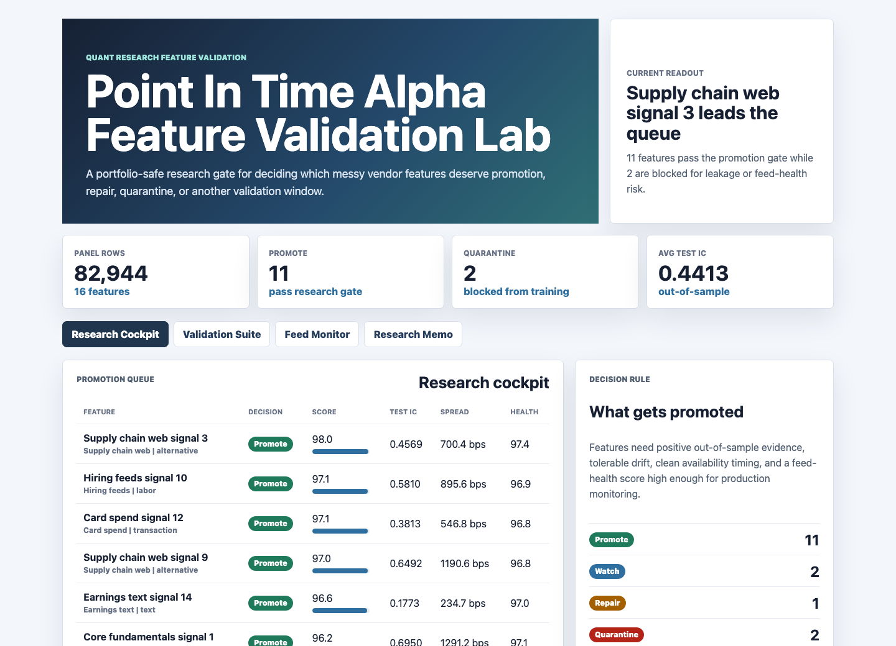
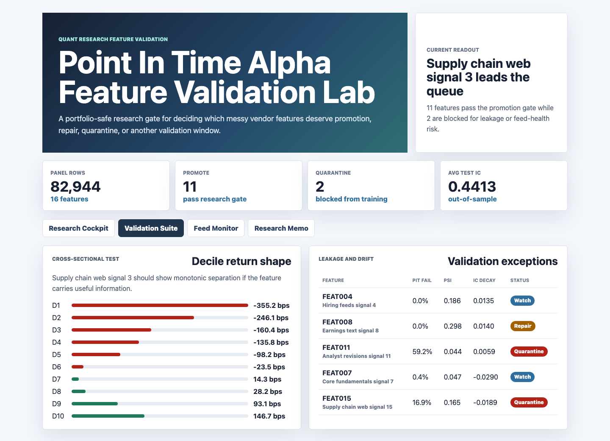
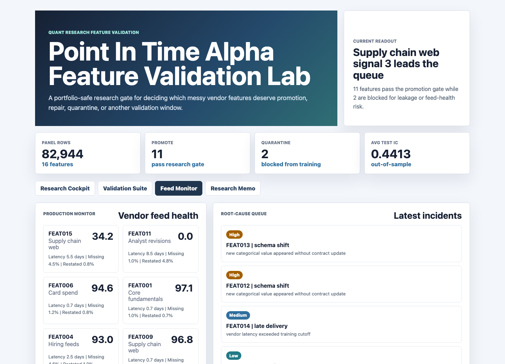
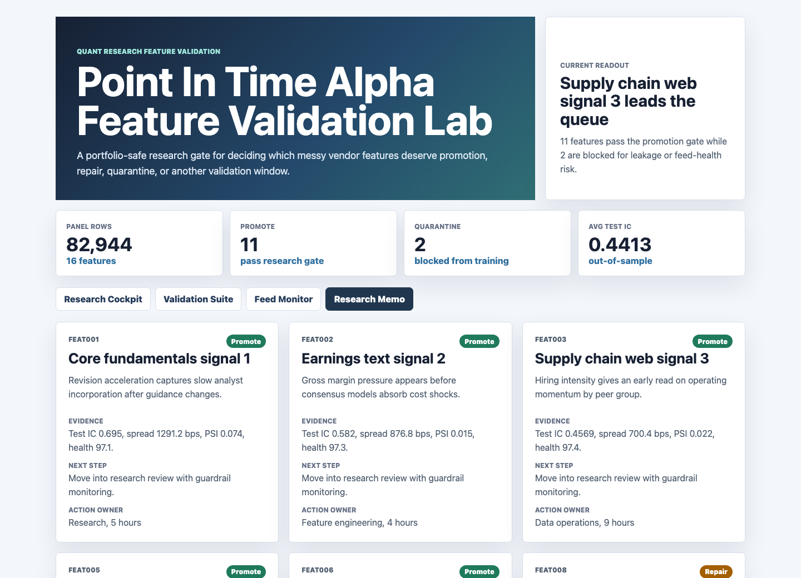

# Point In Time Alpha Feature Validation Lab

This project is a portfolio-safe feature validation lab for quantitative investment research. It turns messy vendor-style feature data into a research gate that decides which candidate signals should be promoted, watched, repaired, or quarantined before they enter model training.

The artifact is built around one practical question: does a feature contain durable information, or does it only look predictive because of leakage, data drift, feed defects, or weak curation?

## Screenshots



**Research cockpit:** Ranks candidate features by promotion score, out-of-sample information coefficient, long-short spread, point-in-time status, and feed health.



**Validation suite:** Shows cross-sectional decile returns for the leading feature and flags leakage, stationarity, and train-test stability exceptions.



**Feed monitor:** Summarizes vendor latency, missingness, duplicates, restatements, and root-cause events that can turn a promising signal into false alpha.



**Research memo:** Converts statistical evidence into interview-ready feature stories with a thesis, evidence, next step, owner, and estimated effort.

## What This Demonstrates

- End-to-end curation of complex tabular data using Python and reproducible generation logic.
- Point-in-time correctness checks that block features whose values arrive after the label cutoff.
- Cross-sectional validation using information coefficient and decile long-short spread.
- Stationarity review using population stability index and train-test degradation.
- Production-facing monitoring for vendor latency, missingness, duplicates, restatements, and incident root causes.
- Clear research communication that connects signal evidence to a decision.

## Data

All data is synthetic and generated by `scripts/score_operating_data.py` with a fixed seed. The synthetic structure mirrors common financial feature-engineering workflows where licensed vendor datasets are not suitable for a public portfolio repository.

Generated tables:

- `data/entities.csv`: 16 candidate features with vendor family, cadence, thesis, owner, and assumed signal direction.
- `data/security_master.csv`: 48 synthetic securities with sector, market-cap bucket, and liquidity bucket.
- `data/daily_metrics.csv`: 82,944 feature-security-date rows with observation date, availability date, forward 5-day label, feature value, missing flag, duplicate flag, restatement flag, and point-in-time violation flag.
- `data/source_events.csv`: 360 feed incidents and research questions with severity and root-cause notes.
- `data/recommended_actions.csv`: 96 candidate actions with owner, effort, and expected research value.

Synthetic assumptions:

- Feature values follow autocorrelated security-level processes with sector shocks and feature-specific signal strength.
- Forward labels combine true feature information, sector noise, and idiosyncratic noise.
- Vendor latency is drawn around each feature's cadence and intentionally worsened for selected features.
- Missingness, duplicate records, and restatements are injected at feature-specific rates.
- Point-in-time violations are created when availability dates fall after the forward label date.
- Stationarity drift is injected into selected features to test whether the validation layer catches unstable signals.

## Analysis Outputs

- `analysis/outputs/feature_validation_summary.csv`
- `analysis/outputs/decile_spreads.csv`
- `analysis/outputs/stationarity_tests.csv`
- `analysis/outputs/point_in_time_checks.csv`
- `analysis/outputs/feed_health.csv`
- `analysis/outputs/research_memos.csv`
- `analysis/outputs/summary.json`
- `analysis/sql_checks.sql`
- `analysis/executive_findings.md`
- `analysis/analysis_plan.md`

## Run Locally

```bash
npm run start
```

Then open `http://127.0.0.1:4173`.

Regenerate the synthetic panel and validation outputs:

```bash
npm run analyze
```

Refresh screenshots after running the local server:

```bash
npm run screenshots
```

## Scope

This is a public portfolio artifact, not a production trading system. It does not use real vendor data, real securities, proprietary returns, or live portfolio information. Its purpose is to demonstrate the validation logic, statistical framing, data-quality controls, and research communication expected in a production-facing feature engineering workflow.
